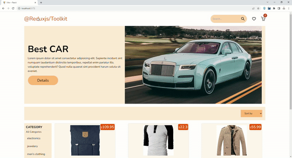

# Redux Toolkit E-Commerce Demo

This project is a simple e-commerce website built to improve your understanding of Redux Toolkit. It fetches data from the [FakeStoreAPI](https://fakestoreapi.com/) and displays products in a user-friendly interface.

## Technologies Used

- **React**: A JavaScript library for building user interfaces.
- **Redux Toolkit**: A toolset for efficient Redux development.
- **React Router DOM**: A library for handling routing in React applications.
- **React Redux**: The official React bindings for Redux.
- **React Icons**: A set of high-quality SVG icons for React.
- **React Paginate**: A React component to render a pagination control.
- **Slick Carousel**: A responsive carousel/slider for React.
- **Tailwind CSS**: A utility-first CSS framework for building custom designs quickly.

## Development Tools

- **Vite**: A fast build tool and development server for React applications.
- **ESLint**: A pluggable linting tool for identifying and fixing problems in your JavaScript code.
- **PostCSS and Autoprefixer**: Tools for enhancing your CSS, including adding necessary vendor prefixes.
- **Babel**: A JavaScript compiler that allows you to use the latest features of the JavaScript language.
- **TypeScript**: A strict syntactical superset of JavaScript that adds static typing.

## Project Setup

1. Clone this repository to your local machine.
2. Navigate to the project directory.
3. Run the following commands to install dependencies and start the development server:

## Additional Notes

This project is for educational purposes and demonstrates Redux Toolkit usage in a simple e-commerce context.
The data is fetched from the FakeStoreAPI, which provides fake product information.
Tailwind CSS is used for styling to keep the project minimal.
Feel free to explore the code and use it as a reference for your own Redux Toolkit projects.